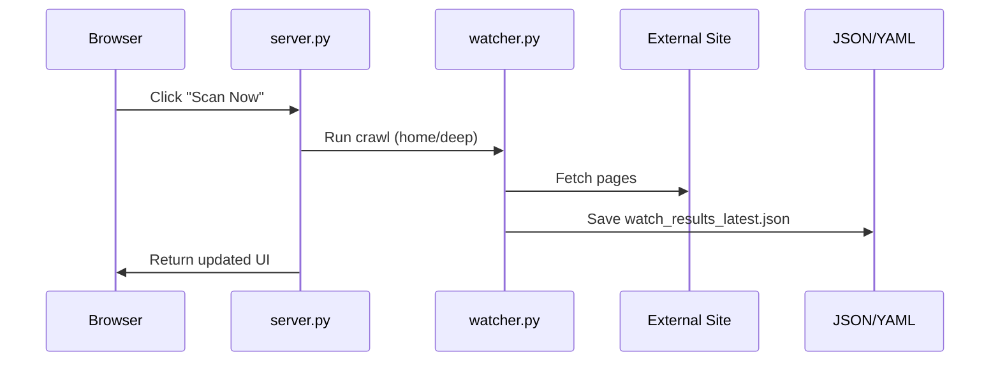
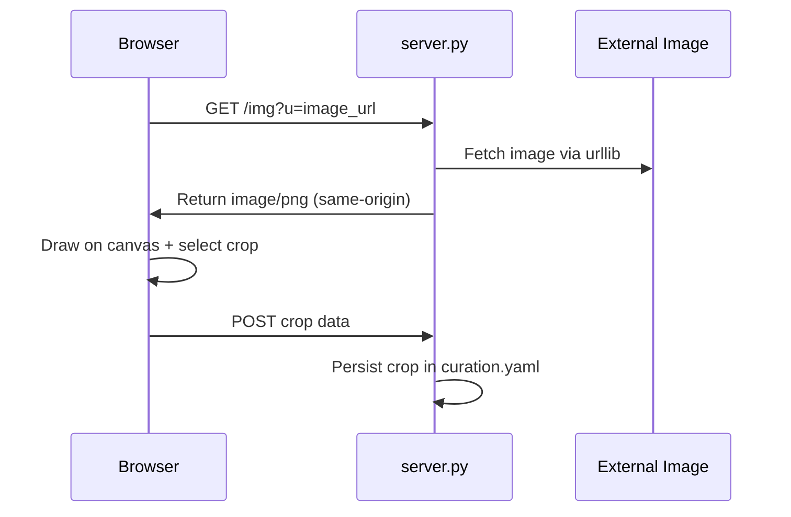
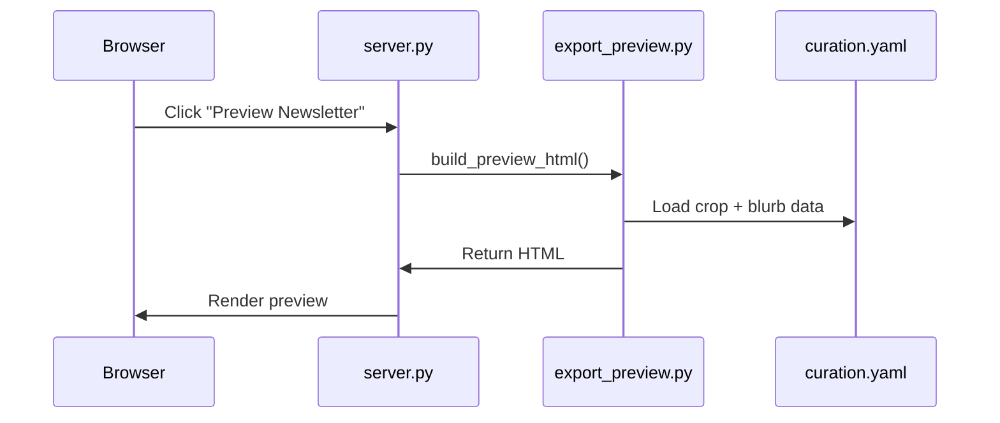

# TSLAC Newsletter Helper
## Design Document
**Updated: February 2026**

---

## 1. Purpose

The **TSLAC Newsletter Helper** is a lightweight local web application designed to:

- Monitor selected external websites
- Identify potential newsletter content
- Allow manual curation (blurbs, excerpts, images)
- Support image selection and cropping
- Generate a styled preview of the monthly newsletter

The system prioritizes editorial control and workflow efficiency over full automation.

---

## 2. High-Level Architecture

The application runs as a single-process Python HTTP server and uses file-based persistence.

It consists of:

- Custom HTTP routing (no web framework)
- YAML + JSON state files
- Server-side image proxy
- Client-side crop UI
- Server-side crop rendering
- Newsletter preview generator

---

## 3. Architecture Diagram (Logical View)

```mermaid
flowchart TD
    Browser[Browser UI]
    Server[server.py]
    Watcher[watcher.py]
    Preview[export_preview.py]
    Store[store_state.py]
    Files[(YAML / JSON Files)]
    Proxy[/img Proxy Endpoint]
    External[External Websites]

    Browser -->|HTTP Requests| Server
    Server --> Watcher
    Server --> Preview
    Server --> Store
    Server --> Proxy

    Watcher --> External
    Preview --> Store
    Store --> Files

    Proxy --> External
    Browser -->|Image Request| Proxy
```

---

## 4. Request Flow Diagrams

### 4.1 Watch Scan



### 4.2 Image Cropping (CORS-Safe)



### 4.3 Newsletter Preview Rendering



---

## 5. Core Modules

| File | Responsibility |
|------|----------------|
| `server.py` | HTTP routing & endpoint handling |
| `watcher.py` | Crawl logic (home & deep modes) |
| `store_state.py` | YAML/JSON persistence helpers |
| `export_preview.py` | Newsletter preview builder |
| `templates.py` | HTML page construction |
| `config.py` | Paths and defaults |

---

## 6. Watch System

### 6.1 Crawl Modes

#### Home Mode
- Fetch homepage only
- Quick scan
- Minimal recursion

#### Deep Mode
- Recursive crawl within domain
- More thorough content discovery

### 6.2 Watch Persistence

| File | Purpose |
|------|---------|
| `watch.yaml` | Watch configuration |
| `watch_results_latest.json` | Latest crawl results |
| `seen_urls.json` | Deduplication tracking |

`seen_urls.json` prevents duplicate processing across scans.

---

## 7. Curation System

Each URL has a record in `curation.yaml`.

Supported fields:

- `final_blurb`
- `excerpts`
- `selected_image`
- `image_crops`

Example structure:

```yaml
https://example.com/article:
  final_blurb: "Edited description..."
  selected_image: "https://example.com/image.png"
  image_crops:
    https://example.com/image.png:
      ix: 787
      iy: 443
      iw: 346
      ih: 486
      img_w: 1201
      img_h: 1201
```

---

## 8. Image Proxy (`/img`) for CORS

Endpoint:

```
GET /img?u=<image_url>
```

Purpose:

- Eliminates browser CORS restrictions for canvas usage
- Fetches remote images server-side
- Returns correct `Content-Type`
- Enables crop UI and preview rendering

Behavior summary:

- Validates URL is http/https
- Fetches with a `User-Agent`
- Uses reasonable timeout
- Returns `Cache-Control: public, max-age=3600`

---

## 9. Crop Rendering in Preview (Final Working Implementation)

### 9.1 Why `left/top` Works

- `transform: translate(%)` is relative to the element size
- `left/top: %` is relative to the container

Cropping requires container-relative movement, so the final implementation uses absolute positioning.

### 9.2 HTML Structure

```html
<div class="heroCrop" style="padding-top:140.462%;">
  
</div>
```

### 9.3 CSS

```css
.heroCrop {
  position: relative;
  overflow: hidden;
  border-radius: 12px;
  border: 1px solid #eee;
  margin-bottom: 10px;
}

.heroCropImg {
  position: absolute;
  display: block;
}
```

### 9.4 Crop Math

Given crop rectangle in original image pixels:

- `ix`, `iy` = crop top-left
- `iw`, `ih` = crop width/height
- `img_w`, `img_h` = natural image dimensions

Compute responsive styles:

```python
w_pct    = (img_w / iw) * 100
h_pct    = (img_h / ih) * 100
left_pct = -(ix / iw)  * 100
top_pct  = -(iy / ih)  * 100
```

Apply as:

```css
width: <w_pct>%;
height: <h_pct>%;
left: <left_pct>%;
top: <top_pct>%;
```

---

## 10. Data Files

| File | Role |
|------|------|
| `selected.yaml` | Selected newsletter items |
| `curation.yaml` | Editorial + crop metadata |
| `seen_urls.json` | Deduplication store |
| `watch_results_latest.json` | Latest crawl results |

---

## 11. Current Status

Working features:

- Watch scanning (home & deep modes)
- Watch status tracking
- Deduplication
- Blurb editing
- Excerpt management
- Image selection
- Image cropping UI
- Crop persistence
- Image proxying
- Responsive cropped preview

---

## 12. Known Limitations

- No crop thumbnail preview in Curate page
- No "Remove Crop" button
- No disk caching for proxied images
- No drag reorder of newsletter items
- No email-client-specific export formatting

---

## 13. Suggested Next Enhancements

### Short-Term
- Add "Remove crop" / "Reset crop" UI
- Show cropped thumbnail preview
- Reorder selected newsletter items
- Constant Contact HTML export block

### Medium-Term
- Local image caching
- Improved crawl filtering rules
- Watch progress improvements

### Long-Term
- Migrate to Flask or FastAPI
- Multi-month archive
- Template engine
- Modular export system

---

## 14. Key Technical Lessons

1. `transform: translate(%)` is relative to element size
2. `left/top: %` is relative to container
3. Crop math must use consistent coordinate systems
4. CORS requires server-side proxying
5. Duplicate helper function names can silently break logic
6. Responsive layouts require percent-based scaling

---

## 15. Stability Summary

The system is:

- Stable in crop rendering
- Stable in preview generation
- Free of CORS errors
- Free of coordinate misalignment
- Functionally complete for the newsletter workflow